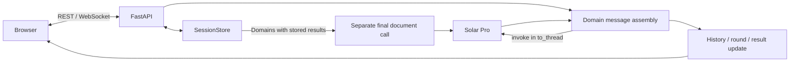
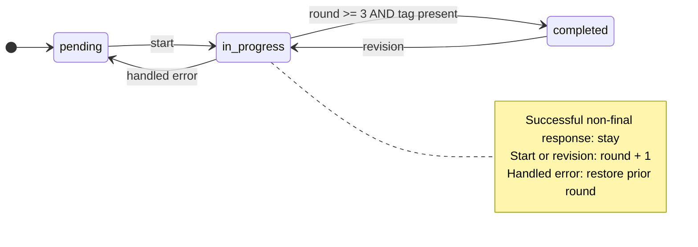

# Project Design Prompt Generator — Technical Details

[Overview and setup](./README.en.md) · [한국어](./DETAILS.md)

This document preserves the portfolio's context separation, state-transition, and synthesis explanations against [source `1972aa05`](https://github.com/SeMinKong/ProjectPromptGenerator_LangGraph/tree/1972aa05d5caca05869a6ba588bf4b7573a7f678). Values below are implementation settings and conditions, not measured quality or latency results.

## 1. Runtime and individual contribution

I implemented the conversation server, memory state store, web conversation/revision UI, and final document flow. FastAPI receives REST and WebSocket requests. `server/graph_runner.py` advances domain state and calls `dimensions/runner.py`, which constructs LangChain messages and invokes `ChatUpstage(model="solar-pro")`.

LangGraph remains in the repository name and dependencies, but this runtime does not register or compile a `StateGraph`, nor invoke a compiled graph. The filename `graph_runner.py` does not establish graph-engine use. The README image is retained as an early planning artifact.

## 2. Session and domain state

[`state.py`](https://github.com/SeMinKong/ProjectPromptGenerator_LangGraph/blob/1972aa05d5caca05869a6ba588bf4b7573a7f678/state.py) defines six defaults: `ux_design`, `architecture`, `database`, `api`, `deployment`, and `testing`. Each session has a project description, API key, domain dictionary, and `final_output` field. Each domain has `id`, `name`, `icon`, `messages`, `status`, `decisions`, `generated_prompt`, and `round`.

Initial state is `pending`, round 0, empty history and result. `TypedDict` describes the structure; it is not a database or workflow runtime. `decisions` is initialized but not updated in the current turn path. The final generator sends its result over WebSocket without writing the `final_output` field.

[`SessionStore`](https://github.com/SeMinKong/ProjectPromptGenerator_LangGraph/blob/1972aa05d5caca05869a6ba588bf4b7573a7f678/server/session.py) keeps UUID-keyed sessions in a process-memory dictionary. Its individual methods use `asyncio.Lock`; an entire LLM turn is not a transaction. WebSocket disconnect deletes the session. Reconnect, restart recovery, and cross-process persistence are absent.

## 3. Context composition and scheduling

[`run_dimension_turn`](https://github.com/SeMinKong/ProjectPromptGenerator_LangGraph/blob/1972aa05d5caca05869a6ba588bf4b7573a7f678/dimensions/runner.py#L14) builds messages in this order:

1. The domain and current-round system instructions.
2. The common project description as a human message.
3. Only that domain's prior history, mapped to AI/human messages.
4. New user input, when present.
5. An explicit final-generation instruction when `round >= 3` and new user input exists.

Other domains' histories are not added. Cross-domain results enter a separate final-document call.

Project initialization starts the selected domains' first turns with `asyncio.gather`—six calls if all defaults are selected. Later user messages await one domain turn inside the WebSocket receive loop; they are not all independently scheduled in parallel. `asyncio.to_thread` moves the synchronous `llm.invoke` away from the event-loop thread. Responses are delivered after each invocation finishes; token streaming is not implemented.

## 4. Rounds, success, completion, and revisions

[`handle_dimension_turn`](https://github.com/SeMinKong/ProjectPromptGenerator_LangGraph/blob/1972aa05d5caca05869a6ba588bf4b7573a7f678/server/graph_runner.py#L22) increments the round and stores/sends `in_progress` before the call. After success, it appends the input, when present, and the response to server history.

Completion requires `current_round >= MAX_ROUNDS` **and** `[GENERATE_PROMPT]` anywhere in the response. The text after the first tag becomes `generated_prompt`. Otherwise a successful response leaves the domain `in_progress` and emits `dimension_question`.

`MAX_ROUNDS = 3` is a generation threshold. The initial question counts as round 1; the conversation does not stop automatically at three turns. `dimension_message` also accepts revisions to completed domains. A tag does not validate document correctness or requirements coverage.

### Handled errors and retained results

On `RuntimeError`, `ValueError`, or `OSError`, the server sends `error`, restores the previous round, and saves `pending`. The failed turn is not appended to **server** history. The browser has already displayed the input when it sends the request, so this is not a rollback of the displayed conversation.

The error path does not clear an earlier `generated_prompt`. A failed revision can therefore leave a pending domain with a prior result. It also does not send a separate `dimension_status(pending)` message, so immediate UI/server status agreement is not guaranteed. This is selective state restoration, not automatic retry or complete exception recovery.

## 5. Final synthesis

[`handle_finalize`](https://github.com/SeMinKong/ProjectPromptGenerator_LangGraph/blob/1972aa05d5caca05869a6ba588bf4b7573a7f678/server/graph_runner.py#L93) selects every domain with a non-empty `generated_prompt`; it does not require current `status == completed`.

- With zero results, it returns an error without a model call.
- With one or more, it combines domain names/results with the project description and makes a separate LLM call.
- Previous results retained during or after failed revisions can be included.
- Separate IDs with the same name remain separate input sections.
- `all_complete` only notifies the UI that all current states are completed. The client must still send `finalize` to generate a document.
- The final instructions request Korean Markdown. `final_document` sends it to the browser without file/database persistence.

## 6. REST and WebSocket protocol

| REST endpoint | Contract |
| --- | --- |
| `GET /`, `HEAD /` | Web UI |
| `GET /health`, `HEAD /health` | `{"status":"ok"}`; not a model authentication or quality check |
| `POST /api/session` | JSON `api_key` → `session_id`; non-empty key check |
| `GET /api/dimensions/defaults` | Default domain list |

The UI requires a key and submits it in the session body. The server also checks the environment variable, but passes the request-body key to the store. There is no automatic `.env` loader; README setup uses the explicit UI key path.

Client messages to `/ws/{session_id}`:

| `type` | Main fields | Behavior |
| --- | --- | --- |
| `project_init` | `content`, optional `dimensions` | Initialize project/domains and start first questions in parallel |
| `dimension_message` | `dimension_id`, `content` | Continue or revise a domain |
| `add_dimension` | `config.id`, `config.name`, optional `config.icon` | Add a pending domain |
| `remove_dimension` | `dimension_id` | Remove a domain |
| `start_dimension` | `dimension_id` | Start a pending domain |
| `finalize` | None | Generate from available stored results |

Server messages:

| `type` | Main fields | Meaning |
| --- | --- | --- |
| `project_ready` | `dimensions`, `project_description` | Initialize tabs and project view |
| `dimension_status` | `dimension_id`, `status` | State notification |
| `dimension_question` | `dimension_id`, `content`, `round` | Successful response without completion |
| `dimension_complete` | `dimension_id`, `prompt` | Extracted generated result |
| `all_complete` | None | All current domains have completed state |
| `final_document` | `content` | Integrated Markdown |
| `error` | `message` | Processing error |

[`ws_handler.py`](https://github.com/SeMinKong/ProjectPromptGenerator_LangGraph/blob/1972aa05d5caca05869a6ba588bf4b7573a7f678/server/ws_handler.py) defines message shapes. Parsing checks JSON and a `type` key; endpoint branches check fields such as domain ID/content. This is not comprehensive message-schema validation.

## 7. Custom domains

The UI sends a name/icon via `add_dimension`, then starts the pending tab through `start_dimension`. An unknown domain ID uses `GENERIC_PROMPT`. To add a persistent default, update the default list in `state.py`; add a matching `DIMENSION_PROMPTS` entry if specialized instructions are needed.

## 8. Verification scope and follow-up work

The original portfolio's per-domain messages, initial parallel calls, state transitions, handled errors, and partial synthesis are documented above with source references. This documentation update did not perform paid LLM calls or fresh quality/latency measurements.

| Implemented | Remaining |
| --- | --- |
| Per-domain history, round and generated result | Requirements coverage and cross-domain conflict evaluation |
| Completion and selected error paths | Complete exception handling, retry, UI state recovery |
| In-memory sessions and disconnect cleanup | Persistence, reconnect recovery, multi-process state |
| Separate final-document call | Final-output storage, versioning and quality validation |

Useful next work is a set of evaluation cases, an explicit policy for prior results during revision, UI/server synchronization after errors, and session recovery. These are current implementation boundaries, not invented historical incidents or new performance results.
