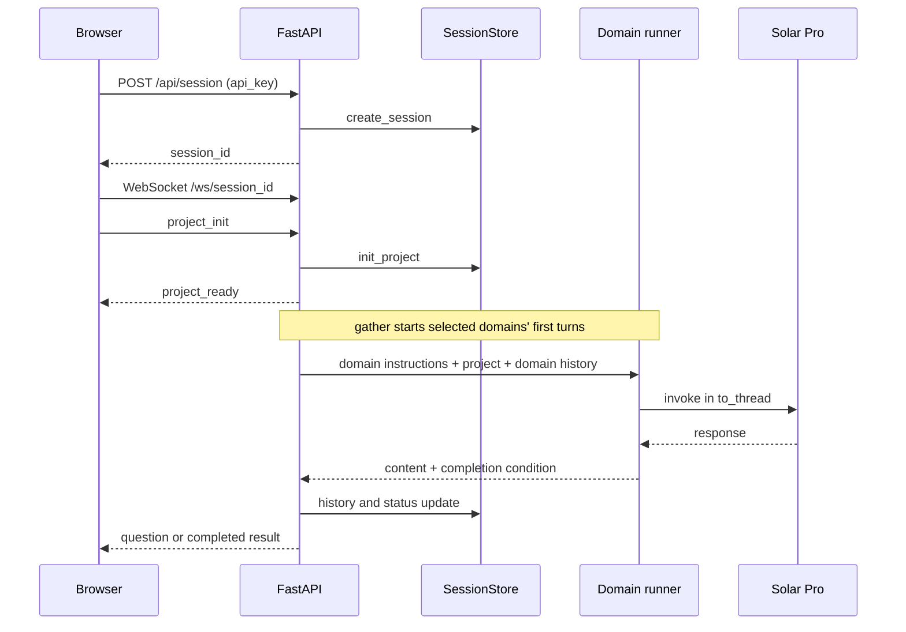
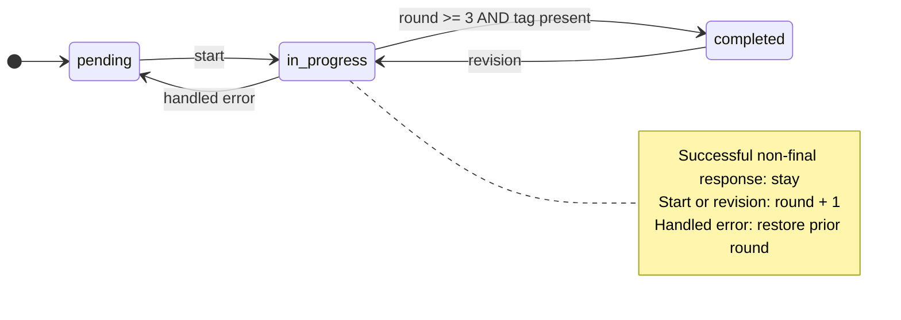

# Project Design Prompt Generator 기술 상세

[프로젝트 소개·실행](./README.md) · [English](./DETAILS.en.md)

이 문서는 개인 프로젝트의 대화 서버·상태 관리 구현과 기존 포트폴리오의 문맥 분리·상태 전이 설명을 정리합니다. 코드 기준은 [`1972aa05`](https://github.com/SeMinKong/ProjectPromptGenerator_LangGraph/tree/1972aa05d5caca05869a6ba588bf4b7573a7f678)이며, 아래 수치는 설정과 조건입니다. 생성 품질이나 지연의 측정 결과를 뜻하지 않습니다.

## 1. 실행 구조와 담당 범위

FastAPI가 REST 세션 생성과 WebSocket 요청을 받습니다. `server/graph_runner.py`는 영역의 라운드와 상태를 갱신하고 `dimensions/runner.py`를 호출합니다. 후자는 LangChain 메시지를 구성해 `ChatUpstage(model="solar-pro")`에 전달합니다. 개인 구현 범위는 이 서버 경로, 메모리 상태 저장소, 영역별 대화·수정 UI, 최종 문서 생성입니다.



저장소 이름과 `requirements.txt`에는 LangGraph가 있지만, 이 서버 경로는 `StateGraph`의 노드·에지 등록, `compile`, 그래프 `invoke`를 사용하지 않습니다. `graph_runner.py`라는 파일명도 그래프 런타임 사용의 근거가 아닙니다. README의 원본 그림은 초기 설계 흐름으로 보존합니다.

## 2. 세션과 영역 상태

[`state.py`](https://github.com/SeMinKong/ProjectPromptGenerator_LangGraph/blob/1972aa05d5caca05869a6ba588bf4b7573a7f678/state.py)는 기본 영역 여섯 개를 정의합니다.

| ID | 영역 |
| --- | --- |
| `ux_design` | UI/UX 디자인 |
| `architecture` | 시스템 아키텍처 |
| `database` | 데이터베이스 설계 |
| `api` | API 설계 |
| `deployment` | 배포 전략 |
| `testing` | 테스트 전략 |

각 세션은 `project_description`, `api_key`, `dimensions`, `final_output`을 갖습니다. `dimensions`는 ID를 키로 하는 사전이며 각 값은 다음 상태를 갖습니다.

```python
{
    "id": "api",
    "name": "API 설계",
    "icon": "🔌",
    "messages": [],        # role / content 목록
    "status": "pending",   # pending | in_progress | completed
    "decisions": [],
    "generated_prompt": "",
    "round": 0,
}
```

`TypedDict`는 상태의 형식을 설명하며 데이터베이스나 실행 엔진이 아닙니다. `decisions`는 초기화되지만 현재 턴 실행 경로에서 갱신하지 않습니다. `final_output` 필드도 존재하지만 최종 생성 함수는 응답을 WebSocket으로 전송하고 이 필드에 저장하지 않습니다.

[`SessionStore`](https://github.com/SeMinKong/ProjectPromptGenerator_LangGraph/blob/1972aa05d5caca05869a6ba588bf4b7573a7f678/server/session.py)는 UUID별 상태를 프로세스 메모리 사전에 저장합니다. 저장소 메서드의 읽기·변경은 `asyncio.Lock`으로 보호하지만, 긴 LLM 호출 전체를 하나의 트랜잭션으로 묶지는 않습니다. WebSocket 연결 종료 시 세션을 삭제하며, 서버 재시작이나 재접속 후 복원 경로는 없습니다.

## 3. 한 영역에 전달하는 문맥

[`run_dimension_turn`](https://github.com/SeMinKong/ProjectPromptGenerator_LangGraph/blob/1972aa05d5caca05869a6ba588bf4b7573a7f678/dimensions/runner.py#L14)의 메시지 순서입니다.

| 순서 | 메시지 | 범위 |
| --- | --- | --- |
| 1 | 영역·현재 라운드의 `SystemMessage` | 영역별 질문 목적과 생성 지침 |
| 2 | 프로젝트 설명 `HumanMessage` | 모든 영역이 공유하는 맥락 |
| 3 | 해당 영역의 이전 메시지 | assistant는 `AIMessage`, 나머지는 `HumanMessage` |
| 4 | 새 사용자 입력 | 입력이 있을 때만 추가 |
| 5 | 최종 프롬프트 생성 요청 | `round >= 3`이고 새 입력이 있을 때 추가 |

다른 영역의 history는 합치지 않습니다. 결과를 함께 고려하는 시점은 별도의 최종 문서 생성 호출입니다.

초기 프로젝트 요청에서 선택된 영역들의 첫 턴을 `asyncio.gather`로 시작합니다. 기본 영역을 전부 선택하면 여섯 호출입니다. 추가 대화는 WebSocket 수신 루프가 해당 영역의 턴을 `await`하므로, 모든 사용자 후속 요청까지 항상 병렬로 처리한다고 설명하지 않습니다. 동기 `llm.invoke`는 `asyncio.to_thread`로 넘깁니다. 응답은 호출이 끝난 뒤 메시지 단위로 전송하며 토큰 스트리밍을 구현한 것은 아닙니다.

## 4. 라운드와 상태 전이



상태 변경은 [`handle_dimension_turn`](https://github.com/SeMinKong/ProjectPromptGenerator_LangGraph/blob/1972aa05d5caca05869a6ba588bf4b7573a7f678/server/graph_runner.py#L22), 완료 판정은 `dimensions/runner.py`가 맡습니다.

1. 호출 전에 라운드를 1 증가시키고 `in_progress`로 저장·통지합니다.
2. 호출이 성공하면 새 입력(있는 경우)과 응답을 서버 history에 추가합니다.
3. `current_round >= MAX_ROUNDS`이고 응답에 `[GENERATE_PROMPT]`가 있으면 첫 태그 뒤 텍스트를 `generated_prompt`에 저장하고 `completed`로 전환합니다.
4. 성공했으나 조건을 충족하지 않으면 history만 갱신하고 `in_progress`를 유지하며 `dimension_question`을 보냅니다.

`MAX_ROUNDS = 3`은 생성 단계로 들어가는 기준입니다. 첫 질문도 라운드 1이며 3에서 대화를 강제로 끝내지 않습니다. 완료된 영역도 `dimension_message`로 수정할 수 있습니다. 태그가 있다는 조건은 문서의 정확성·완성도·요구사항 충족을 검사하지 않습니다.

### 오류와 기존 결과의 관계

`RuntimeError`, `ValueError`, `OSError`를 처리하면 오류 메시지를 보내고 서버의 라운드를 직전 값으로 돌린 뒤 `pending`으로 저장합니다. 실패한 턴의 입력·응답은 **서버** history에 추가하지 않습니다. 브라우저는 전송할 때 입력을 먼저 표시하므로 화면의 실패 입력까지 되돌리는 동작과는 다릅니다.

복원 시 이전 `generated_prompt`를 지우지 않습니다. 이미 결과가 있던 영역을 수정하다 실패하면 상태는 `pending`이지만 이전 결과가 남을 수 있습니다. 이 오류 분기는 별도의 `dimension_status(pending)` 메시지를 보내지 않으므로 서버 상태와 UI 표시가 즉시 일치한다고 보장하지 않습니다. 자동 재시도나 모든 예외의 복원은 구현하지 않았습니다.

## 5. 최종 문서 생성

[`handle_finalize`](https://github.com/SeMinKong/ProjectPromptGenerator_LangGraph/blob/1972aa05d5caca05869a6ba588bf4b7573a7f678/server/graph_runner.py#L93)는 다음 조건으로 입력을 고릅니다.

```python
results = {
    did: domain
    for did, domain in dimensions.items()
    if domain.get("generated_prompt")
}
```

- 결과가 0개이면 오류를 반환하고 모델을 호출하지 않습니다.
- 하나 이상이면 영역 이름·저장된 결과를 나열하고 프로젝트 설명과 함께 별도 LLM 호출에 전달합니다.
- 현재 `status == completed`인지 확인하지 않습니다. 수정 중이거나 수정 실패 후 남은 이전 결과도 대상이 됩니다.
- 서로 다른 ID가 같은 이름을 가져도 각각의 결과가 합성 입력에 남습니다.
- 전체 영역 완료 시 보내는 `all_complete`는 UI 알림이며, 문서 생성 자체를 자동 실행하지 않습니다. 클라이언트의 `finalize` 요청이 필요합니다.
- 최종 프롬프트는 한국어 Markdown 생성을 지시합니다. 결과는 `final_document`로 전달하며 파일·DB에 저장하지 않습니다.

## 6. REST·WebSocket 계약

### REST

| 메서드·경로 | 입력·출력 |
| --- | --- |
| `GET /`, `HEAD /` | 웹 UI |
| `GET /health`, `HEAD /health` | `{"status":"ok"}`; 모델 인증·품질 검사 아님 |
| `POST /api/session` | JSON `api_key` → `session_id`; 빈 키 검사 |
| `GET /api/dimensions/defaults` | 기본 영역 목록 |

현재 UI는 API 키 입력을 요구해 `POST /api/session`에 전달합니다. 서버는 환경변수도 검사하지만, 저장소에는 요청 본문의 키를 넘깁니다. `.env` 자동 로드 코드는 없으므로 README 실행 예시는 UI 키 입력 경로를 사용합니다.

### 클라이언트 → 서버 (`/ws/{session_id}`)

| `type` | 주요 필드 | 동작 |
| --- | --- | --- |
| `project_init` | `content`, 선택적 `dimensions` | 프로젝트·영역 초기화 후 첫 질문 병렬 실행 |
| `dimension_message` | `dimension_id`, `content` | 해당 영역의 후속 턴; 완료 영역 수정 허용 |
| `add_dimension` | `config.id`, `config.name`, 선택적 `config.icon` | 새 영역을 `pending`으로 추가 |
| `remove_dimension` | `dimension_id` | 해당 영역 제거 |
| `start_dimension` | `dimension_id` | 현재 `pending`인 영역의 턴 시작 |
| `finalize` | 없음 | 저장된 생성 결과들로 최종 문서 호출 |

### 서버 → 클라이언트

| `type` | 주요 필드 | 동작 |
| --- | --- | --- |
| `project_ready` | `dimensions`, `project_description` | 초기 화면·탭 구성 |
| `dimension_status` | `dimension_id`, `status` | 진행·완료 등의 상태 통지 |
| `dimension_question` | `dimension_id`, `content`, `round` | 완료되지 않은 성공 응답 |
| `dimension_complete` | `dimension_id`, `prompt` | 태그 뒤 생성 결과 |
| `all_complete` | 없음 | 모든 현재 영역의 상태가 완료임을 알림 |
| `final_document` | `content` | 통합 Markdown |
| `error` | `message` | 처리 오류 |

메시지 생성 함수는 [`server/ws_handler.py`](https://github.com/SeMinKong/ProjectPromptGenerator_LangGraph/blob/1972aa05d5caca05869a6ba588bf4b7573a7f678/server/ws_handler.py)에 있습니다. 파서는 JSON과 `type` 존재를 확인하고, 영역 ID·내용 등은 엔드포인트 분기에서 확인합니다. 완전한 메시지 스키마 검증은 아닙니다.

## 7. 사용자 정의 영역

UI에서 이름과 아이콘을 입력하면 `add_dimension`으로 상태를 추가하고 해당 탭의 `start_dimension`으로 첫 질문을 시작합니다. 기본 목록에 없는 ID는 `get_system_prompt`의 `GENERIC_PROMPT`를 사용합니다. 영구 기본 영역으로 추가하려면 `state.py`의 기본 목록을 수정하고, 전용 질문 지침이 필요하면 `DIMENSION_PROMPTS`에도 ID를 등록합니다.

## 8. 검증 범위와 개선 지점

기존 포트폴리오에 있던 영역별 문맥 구성, 병렬 초기 호출, 상태 전이, 실패 시 선택적 복원, 부분 합성 설명은 위 소스에 대응합니다. 이 문서 갱신 과정에서 유료 LLM 호출이나 생성 품질 평가를 수행하지 않았습니다.

| 확인되는 구현 | 아직 평가·구현하지 않은 범위 |
| --- | --- |
| 영역별 history·라운드·결과 저장 | 요구사항 반영률과 영역 간 충돌 평가 |
| 완료 조건과 처리 오류 분기 | 모든 예외 복원, 자동 재시도, UI 상태 복원 |
| 메모리 세션과 연결 종료 정리 | 지속 저장, 재접속 복구, 프로세스 간 상태 공유 |
| 별도 최종 생성 호출 | 최종 결과 버전 관리·저장·품질 검증 |

후속 작업은 생성 결과 평가 사례를 만들고, 수정 중인 결과와 이전 결과의 표시 정책, 오류 후 UI·서버 상태 동기화, 세션 복구 정책을 명확히 하는 것입니다. 이는 확인된 현재 구현의 경계이며 새 성능 성과나 과거 장애 해결 경험을 뜻하지 않습니다.
