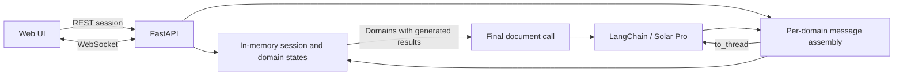

# Project Design Prompt Generator

**[한국어](./README.md) · [Technical details](./DETAILS.en.md) · [Web portfolio](https://seminkong.github.io/SeMinKong_Web/work/project-prompt-generator/)**

A web tool that develops a project idea through separate conversations about UI/UX, architecture, database, API, deployment, and testing, then combines the available results into a Markdown design document.

This is an individual project covering the conversation server, per-domain state management, web UI, and final document generation. Python, FastAPI, and WebSocket connect the server and UI; LangChain's `ChatUpstage` calls Solar Pro.

### Live Demo

[](https://projectpromptgeneratorlanggraph-production.up.railway.app/)


This is an early planning image. The implementation and source links below describe the current runtime. LangGraph remains in the repository name and dependencies, but the public server calls custom state-management functions and does not construct or execute a `StateGraph`.

## What I built

| Area | Implementation |
| --- | --- |
| Domain context | Domain instructions, project description, that domain's history, and new input form each LLM request |
| Initial questions | `asyncio.gather` starts the selected domains' first questions in parallel |
| LLM boundary | `asyncio.to_thread` runs synchronous `llm.invoke` outside the event-loop thread |
| State and revisions | `pending / in_progress / completed`, round, history, generated result, and further messages after completion |
| Document generation | A separate LLM call combines domains with a stored result and the project description |
| Web UI | Domain selection/addition, conversation tabs, progress, preview/copy, resizable panels and text |



## Design decisions

**Separate context per domain.** Every call shares the project description but receives only its own domain's conversation history. Initial parallel questions and later revisions use the same state model.

**A successful response is not necessarily completion.** The first question counts as round 1. Completion requires both `round >= 3` and `[GENERATE_PROMPT]` in the response. Three is a generation threshold, not a maximum number of turns. A successful response without the tag is recorded while the domain remains `in_progress`.

**Restore selected state on handled errors.** On `RuntimeError`, `ValueError`, or `OSError`, the server restores the previous round and sets `pending`. Server history is appended only after a successful call. An earlier generated result remains available if a revision fails.

**Allow partial synthesis.** Final generation selects domains with a non-empty `generated_prompt`, regardless of their current status. One result is sufficient; the all-domains-complete event is a separate UI notification.

[Technical details](./DETAILS.en.md) document state transitions, protocol messages, edge cases, and source references.

## Stack and structure

- Python 3.11, FastAPI, WebSocket
- LangChain Core, LangChain Upstage, Solar Pro (`solar-pro`)
- HTML, CSS, JavaScript
- Docker runtime configuration

```text
server/app.py               REST/WebSocket endpoints and initial parallel calls
server/graph_runner.py      Turn handling, state changes, final generation
server/session.py           In-memory session store
server/ws_handler.py        Message parsing and response shapes
dimensions/runner.py        Message assembly, LLM call, completion check
prompts/dimension_prompts.py Domain and final-document instructions
state.py                    Six default domains and TypedDict state
llm.py                      ChatUpstage model construction
frontend/                   Conversation and preview UI
```

## Quick start

Requires Python 3.11+ and an [Upstage API Key](https://console.upstage.ai/).

```bash
git clone https://github.com/SeMinKong/ProjectPromptGenerator_LangGraph.git
cd ProjectPromptGenerator_LangGraph
python -m venv .venv
# macOS / Linux
source .venv/bin/activate
# Windows PowerShell: .\.venv\Scripts\Activate.ps1
python -m pip install -r requirements.txt
python -m uvicorn server.app:app --reload
```

Open `http://localhost:8000` and enter the API key in the startup dialog. The current UI passes it to session creation. Creating a `.env` file alone does not load it automatically; the steps above use UI key entry. Session creation checks that a key is non-empty; actual authentication happens during the LLM call.

With Docker:

```bash
docker build -t project-prompt-generator .
docker run --rm -p 8000:8000 project-prompt-generator
```

## How to use

1. Enter the API key, describe the project, and select design domains.
2. Answer each domain's questions in its tab after the initial questions arrive.
3. Review generated results, send further revisions, or add a custom domain.
4. Once a result exists, request the integrated Markdown document and copy it.

## Evidence and limitations

- This description follows [implementation `1972aa05`](https://github.com/SeMinKong/ProjectPromptGenerator_LangGraph/tree/1972aa05d5caca05869a6ba588bf4b7573a7f678). Completion tags do not measure document quality or requirements coverage.
- Sessions live in server memory and are deleted on WebSocket disconnect. Refresh, reconnect, and server restart recovery are not implemented.
- There is no automatic retry or full transaction rollback. A prior result retained after a failed revision can still enter final synthesis.
- No quantitative evaluation of generated quality, requirements coverage, or response latency is reported. Evaluation cases and persistence/recovery policies remain future work.

Developed by [Se Min Kong](https://github.com/SeMinKong).
