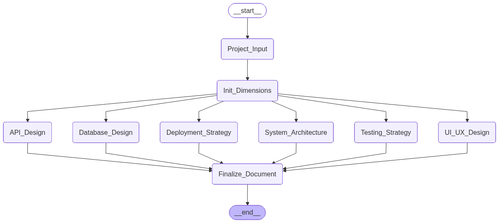

# 프로젝트 설계 프롬프트 생성기 (Project Design Prompt Generator)

> 이 프로젝트는 [SeMinKong/PromptGenerator_LangGraph](https://github.com/SeMinKong/PromptGenerator_LangGraph)의 이전 버전을 기반으로 고도화되었습니다.

AI와 대화하며 프로젝트의 각 설계 영역(UI/UX, 아키텍처, DB, API, 배포, 테스트)을 병렬로 설계하고, 각 영역별 고도화된 AI 프롬프트를 자동 생성하는 웹 애플리케이션입니다.

## 🚀 Live Demo
[projectpromptgeneratorlanggraph-production.up.railway.app](https://projectpromptgeneratorlanggraph-production.up.railway.app)

**Powered by [LangGraph](https://github.com/langchain-ai/langgraph) + [Upstage Solar Pro](https://console.upstage.ai)**

## 주요 기능

- **병렬 에이전트 설계** — 6개 기본 영역(UI/UX, 아키텍처, DB, API, 배포, 테스트)의 전문가 AI가 프로젝트 시작과 동시에 각각의 질문을 시작합니다.
- **심층 대화형 설계** — 각 영역별로 2회 이상의 질의응답을 거쳐 사용자의 요구사항을 상세히 분석한 뒤 설계 프롬프트를 생성합니다.
- **실시간 수정 및 업데이트** — 설계가 완료된 이후에도 추가 요청을 통해 프롬프트를 즉시 수정하거나 보완할 수 있습니다.
- **탭별 개별 미리보기** — 각 설계 영역별로 생성된 프롬프트를 탭을 전환하며 실시간으로 확인하고 복사할 수 있습니다.
- **동적 UI 리사이즈** — 패널 경계선을 드래그하여 각 영역의 크기를 자유롭게 조절할 수 있으며, 폰트 크기(A- / A+) 조절 기능을 제공합니다.
- **보안 중심 설계** — API 키는 서버에 저장되지 않으며, 브라우저 세션 동안에만 안전하게 유지됩니다.

## 동작 방식



1. **프로젝트 설명 입력**: 만들고자 하는 앱이나 서비스의 개요를 입력합니다.
2. **영역 초기화**: 선택된 모든 설계 영역의 에이전트들이 병렬로 실행됩니다.
3. **대화 진행**: 각 탭을 오가며 전문가 에이전트의 질문에 답변합니다 (기본 3라운드 구성).
4. **프롬프트 생성**: 답변이 충분히 수집되면 각 영역별 최종 설계 프롬프트가 우측 미리보기 패널에 출력됩니다.
5. **통합 문서 생성**: 모든 설계가 완료되면 `최종 문서 생성` 버튼을 통해 마크다운 형식의 종합 설계 문서를 얻을 수 있습니다.

## 기술 스택

| 레이어 | 기술 |
|-------|------|
| **LLM** | Upstage Solar Pro (`solar-pro`) |
| **Agent Framework** | LangGraph + LangChain |
| **Backend** | FastAPI + WebSocket (asyncio 기반 병렬 처리) |
| **Frontend** | Vanilla HTML / CSS / JS |
| **Deployment** | Docker / Railway 지원 |

## 프로젝트 구조

```text
├── state.py                  # ProjectState, DimensionState 정의
├── llm.py                    # Upstage LLM 설정 및 추상화
├── legacy/                   # (레거시) CLI 버전 코드 및 초기 그래프
│   ├── graph.py
│   ├── nodes.py
│   └── main.py
├── prompts/
│   └── dimension_prompts.py  # 영역별 전문가 시스템 프롬프트 및 라운드 설정
├── dimensions/
│   └── runner.py             # 에이전트 턴(Turn) 실행기 및 프롬프트 추출 로직
├── server/
│   ├── app.py                # FastAPI 서버 및 WebSocket 라우팅
│   ├── session.py            # 인메모리 세션 및 상태 저장소
│   ├── graph_runner.py       # 병렬 실행 핸들러 및 최종 문서 통합 로직
│   └── ws_handler.py         # WebSocket 메시지 프로토콜 정의
├── frontend/
│   ├── index.html            # 3패널 레이아웃 및 모달 UI
│   ├── style.css             # 패널 리사이즈, 다크 모드 풍 스타일
│   └── app.js                # WebSocket 클라이언트 및 드래그 핸들러
├── requirements.txt          # Python 의존성 통합 관리
├── flow_graph.png            # 프로젝트 동작 흐름도 이미지
└── Dockerfile                # 컨테이너 배포 설정
```

## 설치 및 실행

### 사전 준비

- Python 3.11+
- [Upstage API Key](https://console.upstage.ai)

### 로컬 실행 방법

```bash
# 저장소 클론
git clone <your-repo-url>
cd project_langgraph

# 가상환경 생성 및 의존성 설치
python -m venv .venv
source .venv/bin/activate  # (Windows: .venv\Scripts\activate)
pip install -r requirements.txt

# 서버 실행
uvicorn server.app:app --reload --port 8000
```

`http://localhost:8000` 접속 후 API 키를 입력하여 시작하세요.

## 사용 팁

- **병렬 대화**: 한 에이전트의 답변을 기다리는 동안 다른 탭으로 이동하여 대화를 이어나갈 수 있습니다.
- **추가 수정**: 프롬프트가 이미 생성되었더라도 채팅창에 "XX 부분은 제외해줘"라고 입력하면 즉시 반영된 새 프롬프트가 생성됩니다.
- **UI 조절**: 화면 중앙과 우측의 경계선을 드래그하여 작업 환경에 맞게 패널 크기를 최적화하세요.

## 라이선스

MIT License
