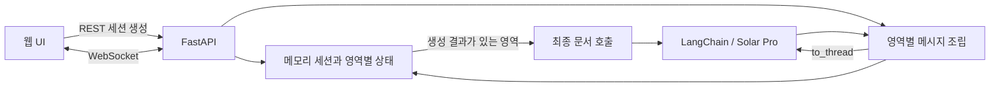

# Project Design Prompt Generator

**[English](./README.en.md) · [기술 상세](./DETAILS.md) · [웹 포트폴리오](https://seminkong.github.io/SeMinKong_Web/work/project-prompt-generator/)**

프로젝트 아이디어를 UI/UX, 시스템 구조, 데이터베이스, API, 배포, 테스트의 여섯 영역으로 나누어 대화하고, 영역별 결과를 하나의 Markdown 설계 문서로 모으는 웹 도구입니다.

개인 프로젝트로 대화 서버, 영역별 상태 관리, 웹 UI, 최종 문서 생성 흐름을 구현했습니다. Python·FastAPI·WebSocket으로 서버와 화면을 연결하고, LangChain의 `ChatUpstage`로 Solar Pro를 호출합니다.

## 공세민의 구현 경험

2026-09-12 작성자 확인·승인 원고입니다.

### 직접 맡은 구현

- UI/UX, 시스템 구조, 데이터베이스, API, 배포, 테스트의 여섯 영역으로 대화를 나누고, 영역별 이력·진행 상태·생성 결과를 독립적으로 관리했습니다.
- 프로젝트 설명과 해당 영역의 대화 이력을 조합해 LLM 입력을 구성하고, 초기 질문의 병렬 호출과 동기 LLM 작업의 별도 스레드 처리를 구현했습니다.
- 사용자가 영역별 결과를 추가 대화로 수정하고, 저장된 결과를 모아 하나의 Markdown 설계 문서로 생성하는 흐름을 구현했습니다.

### 트러블슈팅

- **생성 완료 판정**: LLM이 응답했다고 해서 설계 결과가 완성된 것은 아니므로, 대화 진행과 결과 생성을 구분했습니다. 3라운드 이상 진행되고 생성 태그가 포함된 경우에만 완료로 처리하며, 조건을 충족하지 않으면 대화를 이어가도록 구성했습니다.
- **실패 턴 복원**: LLM 호출 전에 증가시킨 라운드가 실패 후에도 남지 않도록, 처리 대상 오류에서 이전 값으로 복원했습니다. 대화 이력은 호출 성공 후 기록하고, 수정 중 오류가 발생해도 이전 생성 결과는 유지하도록 했습니다.

### 회고

LLM을 활용한 도구에서는 프롬프트 작성과 함께 문맥의 범위, 대화 상태, 완료 조건을 설계하는 일이 중요하다는 점을 배웠습니다. 영역별로 대화를 분리하면서 사용자가 특정 부분만 수정할 수 있는 구조도 경험했습니다. 다음에는 연결 종료 후에도 작업을 이어갈 수 있는 복구 기능과, 생성 문서가 요구사항을 얼마나 반영했는지 평가하는 기준을 보완하고 싶습니다.

## Live Demo

[](https://projectpromptgeneratorlanggraph-production.up.railway.app/)


위 그림은 초기 설계 자료입니다. 현재 실행 경로는 아래 설명과 소스 링크를 기준으로 합니다. 저장소 이름과 의존성에는 LangGraph가 남아 있지만, 공개 서버는 직접 작성한 상태 관리 함수를 호출하며 `StateGraph`를 구성·실행하지 않습니다.

## 구현한 내용

| 범위 | 구현 |
| --- | --- |
| 영역별 문맥 | 영역 지침 + 프로젝트 설명 + 해당 영역 이력 + 새 입력으로 LLM 메시지 구성 |
| 초기 질문 | 선택된 영역의 첫 질문을 `asyncio.gather`로 병렬 시작 |
| 호출 경계 | 동기 `llm.invoke`를 `asyncio.to_thread`에서 실행 |
| 상태와 수정 | `pending / in_progress / completed`, 라운드·대화 이력·생성 결과 관리, 완료 후 추가 대화 허용 |
| 문서 생성 | 생성 결과가 있는 영역들을 프로젝트 설명과 함께 별도 LLM 호출로 합성 |
| 웹 UI | 영역 선택·추가, 대화 탭, 진행 상태, 결과 미리보기·복사, 패널 크기와 글자 크기 조절 |


```mermaid
flowchart LR
    UI[웹 UI] -->|REST 세션 생성| API[FastAPI]
    UI <-->|WebSocket| API
    API --> State[메모리 세션과 영역별 상태]
    API --> Runner[영역별 메시지 조립]
    Runner -->|to_thread| LLM[LangChain / Solar Pro]
    LLM --> Runner
    Runner --> State
    State -->|생성 결과가 있는 영역| Final[최종 문서 호출]
    Final --> LLM
```

## 핵심 설계 판단

**문맥을 영역별로 분리했습니다.** 프로젝트 설명은 공통으로 사용하고, 다른 영역의 대화 이력은 해당 호출에 넣지 않습니다. 초기 질문의 병렬 시작과 영역별 후속 수정이 같은 상태 모델을 사용합니다.

**완료 조건과 응답 성공을 구분했습니다.** 첫 질문도 라운드 1로 계산합니다. `round >= 3`이면서 응답에 `[GENERATE_PROMPT]`가 있어야 결과를 저장하고 완료 처리합니다. 3은 대화의 최대 횟수가 아니며, 태그가 없는 성공 응답은 이력에 기록한 뒤 `in_progress`를 유지합니다.

**처리 가능한 오류의 상태를 복원합니다.** `RuntimeError`, `ValueError`, `OSError`를 처리할 때 라운드를 이전 값으로 되돌리고 서버 상태를 `pending`으로 바꿉니다. 서버 대화 이력은 호출 성공 후에만 추가하며, 이전에 생성한 결과는 수정 실패 시에도 남습니다.

**일부 결과만으로도 문서를 만들 수 있습니다.** 최종 합성은 현재 상태 이름보다 `generated_prompt`의 존재를 기준으로 합니다. 결과가 하나 이상이면 호출할 수 있으며, 전체 영역 완료는 별도의 UI 알림입니다.

[상태 전이·프로토콜·예외 조건과 코드 근거](./DETAILS.md)에 구현 세부를 정리했습니다.

## 기술 스택과 구조

- Python 3.11, FastAPI, WebSocket
- LangChain Core, LangChain Upstage, Solar Pro (`solar-pro`)
- HTML, CSS, JavaScript
- Docker 실행 설정

```text
server/app.py               REST·WebSocket 엔드포인트와 초기 병렬 실행
server/graph_runner.py      턴 진행·상태 변경·최종 문서 생성
server/session.py           메모리 세션 저장소
server/ws_handler.py        메시지 파싱과 응답 형식
dimensions/runner.py        영역별 메시지 조립·LLM 호출·완료 판정
prompts/dimension_prompts.py 영역 지침·생성 문서 지침
state.py                    여섯 기본 영역과 TypedDict 상태
llm.py                      ChatUpstage 모델 생성
frontend/                   대화·미리보기 웹 UI
```

## 빠른 시작

Python 3.11 이상과 [Upstage API Key](https://console.upstage.ai/)가 필요합니다.

```bash
git clone https://github.com/SeMinKong/ProjectPromptGenerator_LangGraph.git
cd ProjectPromptGenerator_LangGraph
python -m venv .venv
# macOS / Linux
source .venv/bin/activate
# Windows PowerShell에서는 .\.venv\Scripts\Activate.ps1
python -m pip install -r requirements.txt
python -m uvicorn server.app:app --reload
```

`http://localhost:8000`을 열고 시작 화면에 API 키를 입력합니다. 현재 UI는 이 키를 세션 생성 요청으로 전달합니다. `.env` 파일을 만드는 것만으로 자동 로드되는 구성은 아니므로, 위 실행 방법은 UI 입력 경로를 사용합니다. 세션 생성 단계는 키가 비어 있는지만 확인하며 실제 인증은 LLM 호출에서 확인됩니다.

Docker를 사용할 경우:

```bash
docker build -t project-prompt-generator .
docker run --rm -p 8000:8000 project-prompt-generator
```

## 사용 방법

1. API 키를 입력하고 프로젝트 아이디어와 설계할 영역을 선택합니다.
2. 선택된 영역의 첫 질문이 준비되면 각 탭에서 질문에 답합니다.
3. 영역별 결과를 확인하고, 필요하면 추가 대화로 수정하거나 사용자 정의 영역을 추가합니다.
4. 생성 결과가 있는 상태에서 문서 생성 버튼을 눌러 통합 Markdown을 만들고 복사합니다.

## 확인 범위와 남은 과제

- 위 설명은 [현재 구현 `1972aa05`](https://github.com/SeMinKong/ProjectPromptGenerator_LangGraph/tree/1972aa05d5caca05869a6ba588bf4b7573a7f678)를 기준으로 합니다. 완료 태그는 생성 품질이나 요구사항 반영률을 검증하지 않습니다.
- 세션은 서버 메모리에 있으며 WebSocket 연결 종료 시 삭제됩니다. 새로고침·재접속·서버 재시작 시 대화 복구는 구현하지 않았습니다.
- 자동 재시도와 전체 트랜잭션 복원은 없습니다. 수정 실패 시 이전 결과가 최종 합성에 포함될 수 있습니다.
- 생성 품질·요구사항 반영률·응답 지연에 대한 정량 평가 결과는 없습니다. 평가 사례와 지속 저장·복구 정책이 후속 과제입니다.

Developed by [공세민 / Se Min Kong](https://github.com/SeMinKong).
